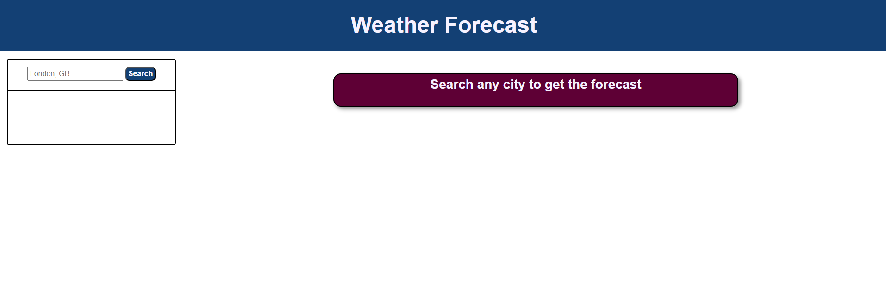
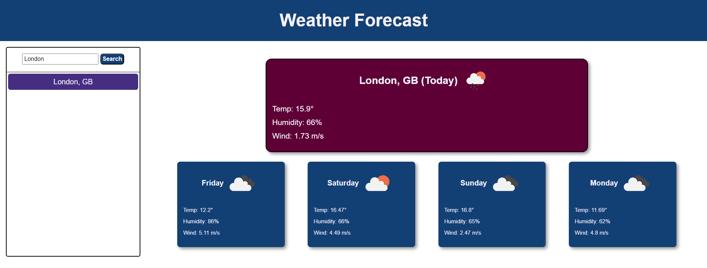
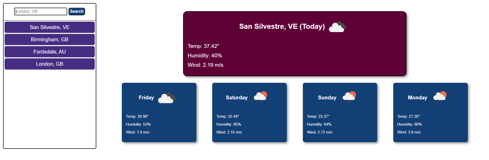

# 5-Day-Weather-Forecast

5 Day Weather Forecast using Openweathermap.org API's to showcase the forecast for the next 5 days when a user puts in a location

## Git Page

[Link to website](https://amillsy.github.io/5-Day-Weather-Forecast/)

## User Story

```
AS A traveler
I WANT to see the weather outlook for multiple cities
SO THAT I can plan a trip accordingly
```

## Acceptance Criteria

```
GIVEN a weather dashboard with form inputs
WHEN I search for a city
THEN I am presented with current and future conditions for that city and that city is added to the search history
WHEN I view current weather conditions for that city
THEN I am presented with the city name, the date, an icon representation of weather conditions, the temperature, the humidity, and the wind speed
WHEN I view future weather conditions for that city
THEN I am presented with a 5-day forecast that displays the date, an icon representation of weather conditions, the temperature, the wind speed, and the humidity
WHEN I click on a city in the search history
THEN I am again presented with current and future conditions for that city
```

## What I have learnt

This is the first time using Server Side API's and how to get data from the API's. It was interesting how to get the data and then how to convert and use the data. This week we had to make a weather forecast using the Openweathermap.org. The first API would get the Latitude and Longitude, which then was passed onto the API that would get me the forecast in the location that I presented. I found it enjoyable to read the documentation and then learn how to manipulated the JSON that I retrieved.

I found it difficult to understand the JSON I recieved back and because I had to make a 5 day forecast, but when getting the JSON, you get 3 hour timestamps. I had manipulate the data I retrieved to get the results I wanted. Furthermore, it was interesting going through the query string, to see how my data would come back and how could use that new sorted data.

## Usage

### Putting in a Location

First the user will be prompted to put in a location to get the forecast.



### Forecast

Shows a 5 day forecast for the location searched.



### Previous Locations

The locations that have been searched will show up on the side and will persistent over page reloads.


